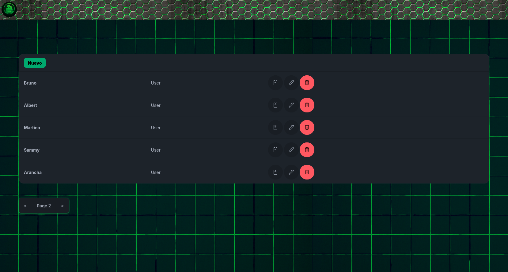

# User Manager

Este microservicio está diseñado para la gestión de usuarios del subbloque administrativo del servidor de **Minecraft Pana Gaming**. Cuenta con una interfaz intuitiva y amigable que permite administrar de manera eficiente y sencilla a los miembros del staff.

Su acceso está restringido únicamente a usuarios con rangos elevados, garantizando que la gestión del personal sea segura y exclusiva para quienes tienen la autoridad necesaria dentro de **Pana Gaming**.

## Apoya este Proyecto
